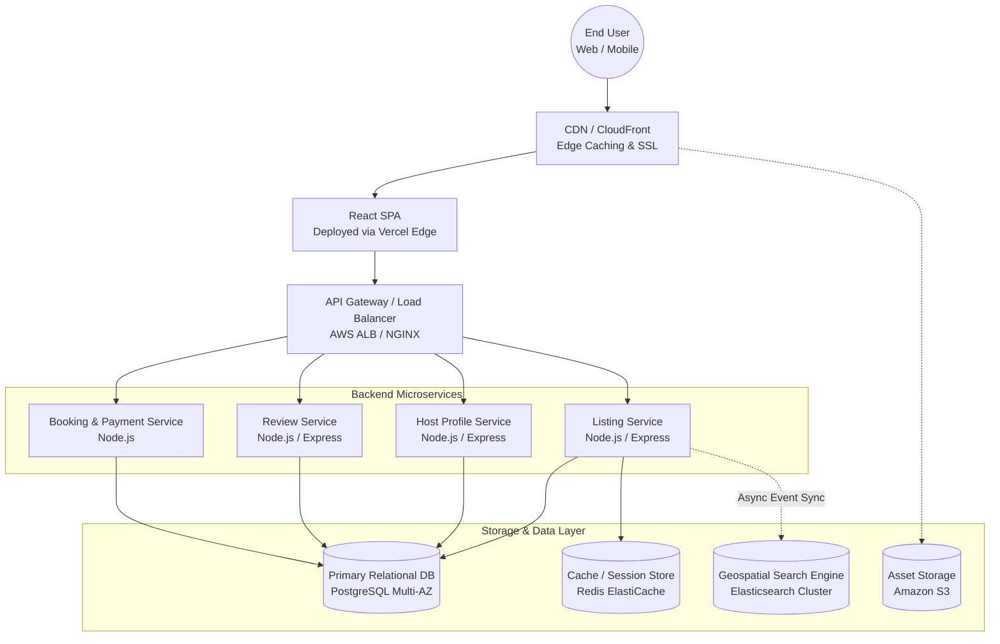

# Airbnb Clone — Production Architecture

This document outlines the high-level production architecture for our vacation-rental marketplace, detailing our scaling strategy across frontend, backend, storage, search, and deployment. 

*(Note: To render the diagram below, you can view this file in a Mermaid-compatible Markdown viewer or copy the block into [Mermaid Live Editor](https://mermaid.live/) to export as a PDF/Image for the final submission).*

## Scaling Strategy

### 1. Frontend Edge Delivery
The UI architecture is strictly component-based (React/Vite). At production scale, this SPA is compiled into static assets and served globally via a **CDN (CloudFront or Vercel Edge Network)**. This ensures that users worldwide receive the HTML/JS/CSS payloads with near-zero latency, offloading traffic entirely from the application servers.

### 2. Microservices Architecture
The current backend is organized by domains (`listing`, `host`, `reviews`). To scale to millions of users, these domains are deployed as independent **Node.js microservices** orchestrated by **Kubernetes (EKS)**. 
* *Why?* During high-traffic seasons (e.g., summer holidays), the `SearchService` and `ListingService` can be scaled horizontally 10x independently of the `HostService` or `ReviewService`, maximizing cost-efficiency.

### 3. Storage & Relational Integrity
**PostgreSQL** is utilized as the primary transactional database. Vacation rentals require strict ACID compliance to prevent double-bookings and maintain financial ledger integrity. Read-replicas are deployed across Availability Zones to handle heavy read traffic (users browsing listings) without impacting write operations (users making bookings).

### 4. Advanced Search & Discovery
A simple relational database is insufficient for an Airbnb clone. We utilize **Elasticsearch** synced asynchronously via message queues (e.g., Kafka) from the primary DB. This handles complex, low-latency geospatial queries (e.g., "Find all homes within 5 miles of this map bounding box available next weekend").

### 5. High-Speed Caching
**Redis** sits between the API Gateway and the databases to handle:
1. Rate-limiting to protect against DDoS attacks.
2. Caching heavily accessed public listings.
3. Fast session retrieval for authenticated users.

### 6. Asset Storage & Optimization
High-resolution property images are stored in **Amazon S3** and routed through an image-optimizing CDN layer that automatically serves WebP formats based on the user's browser, drastically reducing the bandwidth required for the Photo Tour and Lightbox views.
